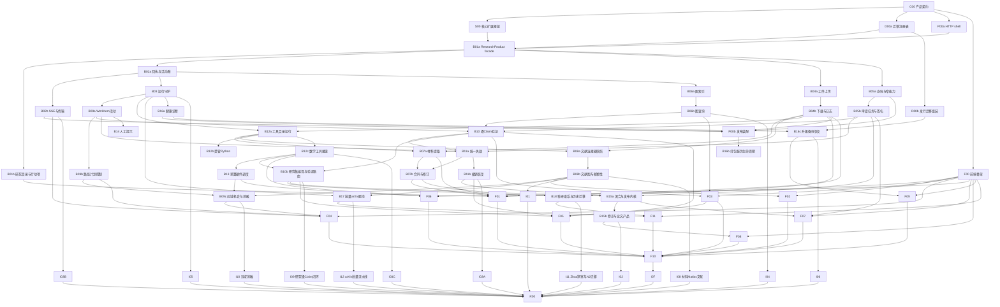

# RK 完整产品实施工作包

状态：`FROZEN_QUEUE / IMPLEMENTATION_ACTIVE`  
版本：`RK-WORK-3`  
依据：同目录的 `product-prd.md`、`product-authority.md`、`product-architecture.md`、`frontend-product.md`  
用途：普通程序员与实施子智能体的唯一任务队列；本文不得改变上游规范

## 1. 开发边界与完成口径

- **本机前端线**只改 `C:\game\ai4math\magi\rk\frontend\` 和分配的前端验收目录；不改 Python、
  数据库迁移、服务器部署或生成 SDK。
- **服务器后端线**在服务器独立 RK worktree 改后端包、schema fragment、HTTP/SSE、守护与后端验收；
  不改本机前端。提交可审阅 commit/patch，由主实例单向集成。
- **主实例**独占规范源、生成 SDK、迁移注册表、composition root、跨线合并、真实 E2E、台账和发布审计。
- 任何实例不得访问或遍历 `C:\canglan\`。服务器路径、主机和凭据只来自部署配置，不写入源码。
- 前端包有两级状态：`IMPLEMENTED_AGAINST_CONTRACT` 与 `PRODUCT_VERIFIED`；fixture 只能达到前者。
- 后端/集成包只有真实 SQLite、迁移、CAS、ResearchKernel/ResearchProduct 路径通过后才可 DONE。

每包完成必须同时具备：冻结输入输出、无跨包私有读取、稳定错误语义、该包独有不变量测试、真实运行
证据和诚实未完成边界。静态页面、schema、mock、截图、测试数量或远端 demo 不能冒充产品能力。

测试只分三层：

- `T1`：无 I/O 的纯算法/guard 不变量；
- `T2`：真实 SQLite、真实迁移、真实 CAS、真实 ResearchKernel/ResearchProduct 的契约测试；只可替换外部
  网络、模型或昂贵工具进程；
- `T3`：打包 UI/发布 HTTP 连接服务器真实进程、工具、数据库和 CAS 的产品 E2E。

HTTP/controller/repository/adapter 不套写同义测试；T2 覆盖后删除或收敛旧浅测试。

## 2. 拓扑顺序

## 3. 主实例承重包

### C00 产品契约与生成 SDK

- **独占**：`docs/spec/product/`、SDK generator/config、`sdk/typescript/`、`sdk/python/` 生成产物。
- **工作**：冻结四操作族 `command/query/subscribe/artifact`；完整 ProductCommand/QuerySpec union；Session；
  scope-tagged envelope（GLOBAL/RUN/DEPLOYMENT）；ProductReceipt 三态与 receipt_version；Job；ActivityEvent；
  ArtifactRef；GraphGroup/GraphSlice/cross-route boundary；
- 所有 scope variant `additionalProperties:false`，正文不得含 actor/role/capability/principal_subject_id；
  ProductReceipt 的 actor subject 由已验证 session 派生并记录。
  RevokePreview；ReviewTask；三种 `IndependentVerifierArtifact`（ATOMIC、COMPOSITION、PAPER）。
- COMPOSITION 必签 proof/scope 与 six parts，每项不可选、无 true default；PAPER 必签六项；
  `authority_effect/promotion_eligible` 只由内核输出。冻结 `PublicActivity` allowlist、错误码、中文术语、
  `MaterialExtraction/SourceSnapshot/LiteratureGraph/TheoremApplicability/ProblemPool/ProblemCandidate/
  BridgeOpportunity/AblationPlan/ResearchCaseLineage`；材料/文献/题池/远域/科研谱系的 command/query variants；
  `/v1/meta` 和 benchmark-profile-v1（固定种子、80% 非孤立、深度≥60、30k DAG edges、冷暖/并发/样本数）。
- **验收**：TS/Python SDK 无损往返；未知 variant 明确报升级；只生成 ResearchProduct client，不生成
  ProductAuthority client。schema 或生成成功本身不算产品完成。

### S00 核心扩展接缝

- **独占**：现有 `kernel/orchestrator/component_runtime/scheduler` 中一次性的扩展注册点及其兼容测试。
- **工作**：为 product command handler、ProjectionMutation、ClosedRunAllowlist、ProductActivityAppend、
  ActivitySink、invalidation consumer、tool receipt、placement 和旧 wire dispatch 提供小而稳定的注册接口；
  后续包只写新模块并注册，不再争抢这些大文件。
- **验收**：旧 CLI/核心行为不变；两个假 handler 可独立注册、拒绝冲突；不得在此实现任何页面功能。

### D00a 产品数据库基线与迁移注册表

- **独占**：产品 migration assembler、版本表、迁移编号和 `schema_fragments/` 注册规则。
- **工作**：各后端包只提交 `schema_fragments/<package>/<slug>.sql` 提案；正式线性编号只由 D00a 分配；
  固定外键、升级/回滚边界。业务包 DONE 前，fragment 必须经 D00a 组装的真实迁移 T2。
- **验收**：registry/assembler 可拒绝编号和表冲突。B16c 只执行迁移，不拥有业务 schema。

### D00b 发行迁移组装

- **依赖**：所有本批业务 fragment；**独占**：发行 migration 序列与 manifest。
- **工作/验收**：主实例每批串行组装；空库安装、当前库升级、失败原子回滚、重复执行幂等；R00 前封版。

### P00a HTTP shell

- **独占**：app factory protocol、router protocol、error/session middleware interface；不拥有真实业务 router。
- **工作/验收**：C00 后冻结装配接口并以假 router 验证冲突/错误映射；不承诺 admin session 或发布 app。

### P00b 发布 composition root

- **依赖**：B01a/B02b/B04b/B05a/B16a；**独占**：`http/app.py`、route registry、daemon main。
- **工作**：挂载 generic command/query、SSE、artifact、session、admin router factories；浏览器不持 capability。
- **验收**：真实空根建立管理员 session；同一发布 app 无循环/重复路由。

## 4. 服务器后端工作包

### B01a ResearchProduct facade、Meta 与产品 CLI

- **依赖**：C00/S00/D00a/P00a。
- **独占**：`product/api.py`、`facade.py`、私有 `authority.py`、kernel adapter、产品 CLI adapter。
- **工作**：实现唯一公共四接口；CLI/HTTP 同走 facade。只有私有 ProductAuthority 可调用 kernel 数学/
  budget/publication apply；GraphQuery/Supervisor/Deployment 无直达路径。旧 rkctl 若保留只标维护入口。
- **验收**：同一请求经 CLI/HTTP 得同语义 ProductReceipt/available_actions；内部模块无旁路 apply。

### B01b 研究目录、正交摘要与“待我处理”

- **依赖**：B01a。
- **独占**：`listing.py`、`summary.py`、`action_items.py`。
- **工作**：CREATE/LIST，owner/labels，outcome/execution/authority/publication/blockers，分页筛选；跨研究
  ActionItemProjection 只聚合权威 next action，已读是非权威 UI 偏好。
- **验收**：创建两个研究并跨研究定位/处理待审查与外部阻塞；不由前端合成状态。

### B02a ProductReceipt、ActivityStore 与 snapshot fence

- **依赖**：B01a。
- **独占**：`operations.py`、`activity_store.py`、integration outbox、对应 schema fragment。
- **工作**：receipt_version；request_id 去重；ProductReceipt PENDING/DECIDED/OUTCOME_UNKNOWN；
  ProductActivityAppend 在 kernel 事务内分配 cursor，host 走 ActivitySink；integration outbox 只外发；同一
  SQLite 一致 snapshot fence。OUTCOME_UNKNOWN 的处置用新 request_id 引用旧 receipt。
- **验收**：同 ID 同 digest 返回同 receipt_id 的当前投影且不重执行、异 digest 冲突；CREATE 使用部署级
  幂等并返回 created_run_id；服务重启可查；数学/host 事件共享 cursor 且不互相
  误失效。禁止 Gateway 幂等缓存和各模块直插 activity 表。

### B02b Receipt 查询、SSE 与传输恢复

- **依赖**：B02a；**独占**：receipt/query/SSE router factory。
- **工作**：PRODUCT_RECEIPT/JOB query；backlog、heartbeat、Last-Event-ID、CURSOR_EXPIRED；事件只按 cursor
  排序，旧 research_revision 活动也交付。
- **验收**：snapshot 后插入 host 活动再推进数学命令，两者均不漏；重复/乱序/重连无倒退。

### B03 RuntimeSupervisor

- **依赖**：B02a；**独占**：`supervisor.py`、`jobs.py`（不拥有 daemon main）。
- **工作**：持久 queue/lease、暂停恢复、协作取消、进程树、服务重启接管；模糊外部副作用进入
  OUTCOME_UNKNOWN，不虚构 exactly-once。
- **验收**：关客户端、杀守护、重启继续；明确查询上游/导入回执/新 attempt/保持阻塞四种处理。

### B04a 分段上传与 CAS commit

- **依赖**：B01a；**独占**：`artifact_upload.py` 和上传 fragment。
- **工作/验收**：浏览器分段、续传、commit 得不可变 ArtifactRef；真实 PDF/TeX/图片/100MB 文件；不能
  提交宿主路径，不重复摘要。

### B04b Range 下载、查看器元数据与日志 tail

- **依赖**：B04a；**独占**：`artifact_read.py`、`log_tail.py` router factory。
- **工作/验收**：Range/media type/name，byte-cursor 日志，服务重启续读；只输出明确 public stdout/stderr，
  不把模型 raw completion 当日志。

### B05a Session、身份与窄 capability

- **依赖**：B01a/D00a/P00a；**独占**：`identity.py`、`sessions.py`、session router、identity fragment。
- **工作/验收**：本机/单组织 session→Main/Worker/Reviewer/Admin 窄 capability；两身份登录/切换；原始
  HTTP 伪造 role/capability/principal_subject_id 被 schema/运行时拒绝；无万能 Gateway 身份。

### B05b ReviewTask 与独立签名导入

- **依赖**：B05a/B04b；**独占**：`reviews.py`、`attestation_import.py`、review fragment。
- **工作**：任务只存 assignment/binding/author/assignee/独立性/status/signed_artifact_ref；草稿非权威。
  验签三个 C00 schema，adapter 不补 true。
- **验收**：三类正例；proof/scope/每个 six-part/PAPER check 的 false、缺失、错 binding、作者同源、
  UNMANAGED/NONE 全拒；Main/任务行/UI 草稿 true 不影响晋级。

### B06a FTS/邻接索引与 watermark

- **依赖**：B02a；**独占**：`graph_index.py` 和可重建索引 fragment。
- **工作/验收**：事件增量追赶、processed cursor/revision；删除重建一致；落后返回 PROJECTION_LAG 或
  同步追赶，绝不以部分图冒充当前 revision。

### B06b GraphQuery、GraphSlice 与撤销预览读取

- **依赖**：B06a；**独占**：`graph_query.py`。
- **工作**：search/slice/closures/revoke preview；Verified/Lineage 分离；GraphGroup；跨路线边界；服务器
  分页与到目标路径。RevokePreview 返回 preview id/digest/revision/contract/target digest/affected digests。
- **验收**：10k/30k 基准；跨路线承重前驱可见；不搬全 snapshot；旧 cursor 明确 stale。

### B07a 材料提取与数学锚点

- **依赖**：B04b/B12a；**独占**：`product/materials.py`、`material_extractors/`、对应 schema fragment。
- **工作**：PDF/TeX/图片/文本 profile；保存原件、提取文本、版面/公式对象、parser/OCR build、页段/公式
  锚点和原文差异。人工修订产生新 extraction artifact；`EvidenceIngest` 只做既有接收检查。
- **验收**：真实公式 PDF、TeX、公式图片和文本；至少一个数学符号解析错误被发现、修订、引用；重启后
  锚点稳定。摘要、UTF-8 或 adapter 单测不能代替。

### B07b 合同、材料引用与局部修订

- **依赖**：B07a/B11a；**独占**：`product/contracts.py`、`contract_materials.py`。
- **工作/验收**：草稿/歧义/确认，合同字段引用精确页段/公式锚点，影响预览与显式 supersede；局部修订
  只通过 B11a 失效受影响对象，无关事实保留。不得由模型替用户选歧义或静默接受 OCR 文本。

### B08a 文献连接器、快照与原文获取

- **依赖**：B04b/B12a；**独占**：`product/literature_connectors/`、`source_snapshots.py`。
- **工作**：清理适配 Danus Matlas 薄客户端并注册 ToolCatalog；实现 OpenAlex/Crossref/arXiv connector；
  所有调用保存 endpoint、时间、请求、原始响应 ArtifactRef、响应 digest、可见版本、覆盖和错误；按 arXiv
  ID/version 获取原文和局部上下文。LIVE_QUERY 与 REPLAYED_SNAPSHOT 分开。
- **证据边界**：当前只有 RK Crossref 和 Danus
  `C:/game/ai4math/frenzymath/Danus/danus/integrations/matlas.py` 的无鉴权 Matlas 客户端；服务器实测
  `leansearch.net/thm/search` 返回 2 条定理。Matlas 服务端/语料/依赖图/Qwen index 不在部署中。保留
  Apache-2.0 来源/许可证，不复制未获许可数据。
- **验收**：当前可用端点真实返回并入 CAS；断网后重放完全一致且标历史；schema drift/no-hit/超时有回执。

### B08b 文献搜索图、适用性与新颖性

- **依赖**：B08a/B07a；**独占**：`product/literature_graph.py`、`theorem_applicability.py`、`novelty.py`。
- **工作**：作者—论文—定理—引用图逐边标 Matlas/OpenAlex/Crossref/arXiv/人工来源；去重、版本、引用
  锚点、假设/量词/符号适用性，关联合同/Claim/路线/BridgeSpec，相似工作对照和人工边界。
- **验收**：多源在线+导入+快照重放；Matlas theorem 关联精确 arXiv 上下文；缺席/无命中、服务失败或
  仅薄客户端均不生成“新颖”。不得把 RK 组合的作者/引用边称为 Matlas 原生。

### B09a WorkItem、WorkerRun、attempt 与 ActivitySink

- **依赖**：B03/S00；**独占**：`work_activity.py`、orchestrator activity adapter。
- **工作**：work_item 逻辑稳定；每次角色重分派新 worker_run；pending process 恢复可沿用；每次宿主执行
  新 attempt；公开 allowlist ingestion 时丢弃 reasoning/raw completion。
- **验收**：一个任务两个失败 worker run+一个成功、多 attempt，历史不覆盖成功；诊断/搜索无 CoT。

### B09b RoutePlan 与正式路线控制

- **依赖**：B09a；**独占**：`route_plan.py`、orchestrator route-control adapter。
- **工作/验收**：RouteProposal/Plan，APPLY_ROUTE_PLAN 批准/启动/暂停/停止/优先级/预算；三条结构路线
  被批准，停止一条后不再派生 work item；hint 不替代控制动作。

### B09c 远域机会选择与正式消融

- **依赖**：B08b/B09b/B13；**独占**：`product/bridge_opportunities.py`、`ablation.py`。
- **工作**：源问题规范化、目标域候选、领域距离、源域成熟度、目标缺席度、原生工具优势、预期证书
  压缩、映射/假设损失、回译成本和死亡测试；通过后只用现有 BridgeSpec handler。冻结
  direct/near/far-random/far-retrieval/full-RK 的题池、模型、工具、候选数、预算和终局 verifier。
- **验收**：五组真实运行保留全部机会、拒绝桥、失败分母、成本、证书长度和同一 verifier receipt；组间
  配置漂移稳定拒绝。full-RK 是否更好是输出，不是通过断言；不建第二编排器或结果真值库。

### B10 原子 Claim、检索注入与统一验证门

- **依赖**：B05b/B06b/B09a；**独占**：`claims.py`、`validation_gateway.py`、注册 handler。
- **工作/验收**：一次一 Claim、必要子图、拒绝修复谱系、Lean/checker/人类/软 verifier 路由；多 Worker
  拒绝—修复—检索复用；只有 kernel promotion 写有效图。

### B10b 研究稿规范化、验证路由与义务更新

- **依赖**：B10/B12c；**独占**：`product/research_draft.py`、`verifier_planner.py`、`obligation_adapter.py`。
- **工作**：消费公开研究稿工件和必要事实子图，产出候选原子 Claim、前驱、类型、未定义符号和 verifier
  plan；按当前合同/Claim 类型调用注册 verifier；把结果逐 Claim 提交 B10，并由内核接受事件触发现有组合
  义务/ClosureWitness readiness 更新。不得从模型总结直接关义务。
- **验收**：研究级问题的真实模型稿拆为多 Claim；至少两种异质 verifier；一项拒绝后修复、后续检索
  复用、义务更新或诚实阻塞。不得用 n+0=n、奇数和、人工 DB 字段或 prompt 声明替代。

### B11a AuthorityInvalidation 单一失效引擎

- **依赖**：B05b/B09a/B10；**独占**：`invalidation.py`。
- **工作**：唯一 `invalidate_from(kernel_event)` 原子处理 checkpoint/queue/tool feedback/composition/
  review/witness/publication；kernel 事务先写权威 invalidation ledger/watermark，消费者幂等物化执行/UI
  状态，落后时 ProductAuthority 返回 AUTHORITY_PROJECTION_LAG。其他包不得各写算法。
- **验收**：在 kernel commit 后、consumer 前强杀进程，重启前后旧审查/feedback/checkpoint/publication
  均不可消费；追平后状态完整且 sibling 保留；同 stable label 异 digest 冲突。

### B11b 撤销、级联与重新证明恢复

- **依赖**：B06b/B11a；**独占**：`revocation.py`。
- **工作/验收**：confirm 只引用 preview id/digest，kernel 事务重算。预览后新增下游、替换 target、改合同
  均 stale；重预览撤销全下游，sibling 保留；replacement 后闭包恢复。

### B12a ToolCatalog、ToolRun 与统一回执

- **依赖**：B03/B04b/S00；**独占**：`compute.py`、`tool_runs.py`。
- **工作/验收**：结构参数、attempt、资源、日志、工件、authority ceiling、取消/重跑/比较；调用成功和
  VALIDATION_ACCEPTED 分栏。工具无图写接口。

### B12b 受管 Python

- **依赖**：B12a；**独占**：`managed_python.py`、环境 profile。
- **工作/验收**：固定 lock/env、只读输入/输出、CPU/内存/墙钟、进程树；NumPy/SciPy/SymPy/NetworkX
  表格与图片；失败修参；普通 Python 永远 SOFT/NO_FACT_GRAPH_WRITE。无任意 shell。

### B12c Lean/SMT/CAS/枚举与模型函数接缝

- **依赖**：B12a；**独占**：产品 adapter 模块，不拥有底层成熟实现。
- **工作**：统一记录 provider/model/build/profile/function schema/usage/cost/ToolRun/authority ceiling；接入
  既有 DeepSeek V4-Pro、DeepSeek Responses、LeanSearch、jixia、Lean、Z3、SymPy、精确枚举和
  DeepSeek-Prover 基线。GPT-5.6 未配置；Codex 文本成功不补成工具成功；QED-Nano smoke、Rethlas 504、
  Archon 未有研究级回执分别保持 `SMOKE_ONLY/EXTERNAL_BLOCKED/CONFIGURED_UNPROBED`。
- **验收**：同一 run 真实进程/服务回执；外部未配置诚实阻塞；Codex shell 无副作用/custom apply_patch
  失败不可显示完成；exit 0/binding 错不晋级。成熟适配不缩水，也不借其他 provider 回执染绿。

### B13 预算、硬件与并发调度

- **依赖**：B12c；**独占**：`budgeting.py`、`placement.py` adapter。
- **工作**：策略/测量/placement 通过 ProductAuthority 提交既有 kernel RecordBudget；唯一账仍是 kernel
  reservation/actual/refund/UNKNOWN_COST，不建第二账本。NVIDIA/ROCm/CPU/API、并发组和串行晋级。
- **验收**：真实 CPU+ROCm/API 同 run、预算暂停恢复、时间区间重叠而晋级稳定；不以 sleep 冒充。

### B14 人工提示生命周期

- **依赖**：B09a；**独占**：`guidance.py`、orchestrator guidance adapter。
- **工作/验收**：绑定 revision/contract/checkpoint/目标，QUEUED/APPLIED/REJECTED/SUPERSEDED/CANCELLED；
  换表示/优先引理真实改变后续，停止路线仍须 B09b 正式动作；提示不写图。

### B15a 闭合、Finalize 与 CLOSED-run publication 命令

- **依赖**：B05b/B11b/S00；**独占**：新 `publication_handlers.py`、payload schema 和 fragment；只通过
  S00 注册，不直接拥有旧 guard/projector/wire 文件。
- **工作**：ClosureWitness→唯一 ROOT→Finalize；给 CLOSED run 增精确白名单
  `GenerateCandidateTex` / `SubmitPaperReview` / `CompileReviewedPaper`，共用 kernel revision/event/receipt，
  只改 publication projection。review 绑定 finalized revision、ROOT/closure/TeX digest 与 generation command。
- 身份固定：Generate/Compile=PUBLICATION_WORKER，SubmitReview=PAPER_REVIEWER；Main 只请求作业，不代执行/签名。
- **验收**：正链；普通 CLOSED 命令、非 finalized、非唯一 ROOT、错 finalized revision/TeX/closure/身份
  全拒且拒绝不推进 revision。禁止另建 PublicationKernel/产品层状态机。

### B15b 卷宗、论文工件与编译返修

- **依赖**：B15a/B04b；**独占**：`publication.py`、`dossier_product.py`。
- **工作/验收**：finalized snapshot 确定性 TeX、审查任务、同 digest PDF、编译日志/返修、新摘要重审；
  卷宗任何状态可读。数学家主页无候选 TeX；只有 PAPER_REVIEWER 精确任务可读。

### B16a 部署健康与类型化诊断

- **依赖**：B03/B04b；**独占**：`deployment.py`、`diagnostics.py`。
- **工作/验收**：能力真实探测、硬件/成本/故障；诊断从 PublicActivity/类型化投影构建，不扫描目录，
  不泄露凭据或隐藏推理。

### B16b 打包、Windows service/Tauri sidecar 生命周期

- **依赖**：B16a/P00b；**独占**：packaging/service manifests。
- **工作/验收**：安装包已启动的空根 bootstrap、启动停止、桌面退出后台继续；不拥有业务迁移。

### B16c 升级、备份与新目录恢复

- **依赖**：B16a/D00b；**独占**：`backup.py`、upgrade/restore runner。
- **工作/验收**：SQLite/CAS/不可重建配置备份，当前→下一版升级，新目录恢复，索引重建，run/artifact/
  cursor/checkpoint/终态一致。

### B17 批量 arXiv 开放问题流水线

- **依赖**：B03/B08b/B01b；**独占**：`product/problem_pool.py`、`arxiv_batch.py`、对应 schema fragment。
- **工作**：冻结日期/学科/版本/撤稿和排除规则；抽取 Conjecture/Problem/Question，恢复定义、量词、假设，
  去重、人工抽查并冻结题池；按重要性/可验证性/桥潜力/成本生成建议，经正式 GLOBAL 命令批量创建 run。
  保存全部纳入、排除、失败、阻塞分母；机器证书→异源复核→专家/作者确认状态分开。
- **验收**：真实 arXiv 窗口和至少一个版本/撤稿边界；批量创建多个研究；重启/恢复不重复；专家未到位
  保持 EXTERNAL_CONFIRMATION_PENDING。语义冻结抽查、外部确认与数学成功率不得伪造自动通过。

### B18 科研谱系、Zhao 净室与历史迁移

- **依赖**：B04b/B10b；**独占**：`product/research_lineage.py`、`case_import.py`。
- **工作**：历史 ArtifactRef、来源和版本进入 ResearchCaseLineage；Zhao 的
  CLEAN_ROOM_REDISCOVERY 与 IMPORTED_CERTIFICATE_VERIFICATION 使用不同输入 manifest 和 run；
  `N2_AJT5` 手工历史只迁为材料/候选 Claim，再过当前合同和 B10 写门。
- **验收**：当前冻结树新数据根实际运行两种 Zhao 模式；净室 manifest 不含历史结论/证明/证书，导入模式
  逐证书列 verifier receipt；迁入一批 N2 候选且未验证项不入图。净室科研结果允许未重现，谱系不得混淆。

## 5. 本机前端工作包

所有 F 包只消费 C00 SDK；每包负责自己页面的键盘、200% 缩放、屏幕阅读器、减少动画和非颜色状态，
F10 不跨目录代修。

### F00 React 工作台、设计系统与术语

- **独占**：`frontend/src/app/`、`design/`、共享可访问原语。
- **工作**：React/Vite，八项导航，暖象牙/墨蓝，固定身份/run 上下文，数学公式、focus、图列表组件；
  冻结“待核验命题/已验证事实/研究任务/一次执行/第N次运行/最终结论/闭合检查记录”等中文。
- **验收**：连接 `/v1/meta`；fixture 醒目标“离线示例”，绝不显示“真实运行”。

### F01 研究、合同与附件
- **独占**：`features/research/`、`contract/`、`materials/`；**产品验收后端** B01b/B04a/B04b/B07a/B07b。
- **验收**：浏览器创建研究、上传 PDF/TeX/图片/文本，查看原件/提取/公式差异和页段锚点，修订一次解析
  错误，确认合同并在局部修订时看完整失效差异。

### F02 文献与新颖性
- **独占**：`features/literature/`；**产品验收后端** B08a/B08b/B12a。
- **验收**：Matlas/多源在线+导入+历史快照重放；arXiv 上下文/适用性、搜索图边来源、定位/对照/边界
  完整；明确没有本地 Matlas 后端/语料/index，无“无命中=新颖”。

### F03 Horizon 路线事实图
- **独占**：`features/graph/`；**产品验收后端** B06b/B10。
- **工作**：改造 Horizon DagNetwork/dagGraph/vizWorker/vizInstance；有效图/谱系分栏、GraphGroup、跨路线
  边界、单组展开、Graphviz WASM、等价列表。
- **许可随代码提交**：来源注释、上游 LICENSE/NOTICE/THIRD_PARTY 条目和修改说明；lockfile 精确锁定
  `@viz-js/viz`，不等 R00 补。
- **验收**：10k/30k 不下载全图；跨路线承重前驱可定位；重复布局确定。

### F04 路线计划、工作项与动态活动
- **独占**：`features/work/`、`activity/`、`bridge/`、`ablation/`；**产品验收后端** B02b/B09a/B09b/B09c。
- **验收**：批准三路线、停止一条；远域机会字段/死亡测试/BridgeSpec 可追；五组消融完整分母且不预设
  胜者；50 活跃/500 历史三次交互定位；一个任务多 worker/attempt；无 CoT。

### F05 Claim 检查、验证、谱系与撤销
- **独占**：`features/claim/`、`revocation/`；**产品验收后端** B10/B10b/B11a/B11b。
- **验收**：研究稿原子化、verifier plan/实际路由、拒绝修复、工具/权威分栏、义务更新、stale 撤销、
  sibling、重新证明恢复。

### F06 科学计算与工具
- **独占**：`features/compute/`、`tools/`；**产品验收后端** B12a/B12b/B12c/B13。
- **验收**：Python/Lean/Z3/CAS/枚举真实运行；表/图/日志；OUTCOME_UNKNOWN 四种处理；工具成功不着色为事实。

### F07 身份与独立审查
- **独占**：`features/review/`、`identity/`；**产品验收后端** B05a/B05b/B15a/B15b。
- **验收**：两个独立身份；未签草稿可编辑但无 true 预填；签名由 reviewer session 提交，Main 无构造入口。

### F08 状态卷宗与最终论文
- **独占**：`features/dossier/`、`publication/`；**产品验收后端** B15b。
- **验收**：Main 在列表/路线/卷宗都只见“结论已冻结，等待独立复核”，无候选 TeX；仅 reviewer 任务
  可读；完整 finalized→review→same digest PDF 与编译返修。

### F09 管理中心
- **独占**：`features/admin/`；**产品验收后端** B13/B16a/B16b/B16c。
- **验收**：空根 bootstrap、健康、作业、升级备份恢复；Rethlas 504 诚实阻塞。

### F10 ProductReceipt、重连和陈旧 UX
- **独占**：`frontend/src/platform/receipts/`、`reconnect/` 和只读跨页审计；不得直接改 F01–F09。
- **工作/验收**：request_id 对账、PENDING/DECIDED/OUTCOME_UNKNOWN、409 差异/重应用草稿、SSE 重连、
  全局待我处理去重。发现页面 a11y 缺陷回派原 owner。

### F11 题池与科研谱系

- **独占**：`features/problem-pool/`、`research-lineage/`；**产品验收后端** B17/B18。
- **工作/验收**：arXiv 日期/学科/版本/撤稿、语义抽查、纳入排除和完整分母、批量创建；专家/作者待办；
  Zhao 净室与导入核验两个模式/manifest；N2_AJT5 历史只显示候选。失败不被成功卡过滤。

## 6. 主实例真实集成包

### I01 合同、附件、文献与身份入口
依赖 B01a/B01b/B04a/B04b/B05a/B05b/B07a/B07b/B08a/B08b/B12a + F01/F02；从打包 UI 以真实身份完成。

### I02 真实多路线数学全链
依赖 B09a/B09b/B10/B10b/B11a/B11b/B12a/B12b/B12c/B13/B14/B15a/B15b + F03–F08；同一 run：批准三路线、研究稿逐 Claim、拒绝修复、工具、人工干预、闭合、唯一
ROOT、Finalize、finalized snapshot 候选 TeX、独立复核、同 digest PDF。

### I03a 权限、审查、图与发布负链
依赖 B05a/B05b/B10/B11a/B11b/B15a/B15b + F05/F07/F08；覆盖 authority §11.2、§11.3 的 ClaimWorkflow/
VerifiedFactGraph/stable-label 部分及 §11.4。

### I03b Command、SSE、checkpoint 与失效负链
依赖 B02a/B02b/B03/B05a/B05b/B07b/B09a/B11a/B11b/B15a/B15b + F04/F07/F08/F10；三断连窗口、旧 revision 活动、合同/撤销/
checkpoint、撤销三竞态；同一 kernel event 使 queue/tool feedback/checkpoint/review/witness/publication
全部失效且 sibling 保留，并覆盖 invalidation consumer 崩溃窗口。

### I03c 工具权威与隐藏推理负链
依赖 B04b/B09a/B12a/B12b/B12c/B16a + F04/F06/F09；覆盖 authority §11.3 的工具 authority 部分及 §11.6：provider 隐藏字段在 event/snapshot/search/artifact index/diagnostic/
report/UI 全无命中；exit 0 不晋级。

### I04 大图与动态工作规模
依赖 B06a/B06b/B09a + F03/F04；benchmark-profile-v1 下报告 server compute、TTFB、完整页、浏览器 layout；旧
5000/59/60 仅保留为混合深链证据。

### I05 中断、后台继续与模糊结果
依赖 B02a/B02b/B03/B12a/B12b/B12c + F04/F06/F10；网络/守护/桌面/进程失败，OUTCOME_UNKNOWN 人工处置。

### I06 安装、升级、备份恢复
依赖 P00b/B16a/B16b/B16c/D00b + F09/F10；空根→初始化→研究→备份→升级→新目录恢复→索引重建。

### I07 全旅程可访问性与非技术中文
依赖 F01–F11；键盘和屏幕阅读器分别完成合同、跨路线定位、材料/文献核查、题池、计算检查、审查签署、故障恢复和最终下载；
默认页面不暴露 BridgeSpec/stable label/digest 等内部词。

### I08 材料、Matlas 与多源文献
依赖 B07a/B08a/B08b + F01/F02；正式 UI 上传四类材料并修订公式提取错误，实际查询 Matlas/多源、拉取
arXiv 上下文、审查适用性、断网快照重放；保存 ToolRun/SourceSnapshot/锚点，服务边界和图边来源准确。

### I09 研究级自动 Claim 闭环
依赖 B10/B10b/B12c/B15a + F03/F05/F06；研究级问题真实模型稿→多原子 Claim/前驱/类型→至少两类
verifier→拒绝修复→回图/检索复用→组合义务/ClosureWitness readiness，禁止 toy 题和人工 DB 填充。

### I10 远域套利消融
依赖 B08b/B09c/B12c/B13 + F04/F06；固定题池、模型、工具、候选数、预算和终局 verifier 运行五组，
保留全部 BridgeOpportunity、死亡测试、BridgeSpec、失败分母、成本和证书长度。科研效果按结果报告。

### I11 Zhao 净室与 N2 历史迁移
依赖 B18/B10b + F05/F11；冻结当前树/新数据根运行 Zhao 两模式，核对输入 manifest 和证书 receipt；迁移
一批 N2_AJT5 历史候选并证明其未绕过当前验证门。净室未重现不篡改产品验收结论。

### I12 批量 arXiv 开放问题流水线
依赖 B17/B08b/B10b + F02/F11；真实日期/学科窗口、版本/撤稿、抽取与人工抽查、冻结题池/排除规则、
批量建 run、机器证书/异源复核/专家作者待办；manifest 含全部纳入、排除、失败和阻塞。

### R00 发布审计

- **依赖**：I01–I12 全通过。
- 跑一次发布质量门：后端完整 pytest/Ruff/mypy，前端 production build/typecheck/lint，关键打包 Playwright；
  这些是质量门，不替代 T3。T3 manifest 保存 tree digest、deployment、run_id、receipts、cursors、artifacts、timings。
- 状态只允许 `PRODUCT_E2E/BACKEND_ONLY/FRONTEND_ONLY/SPEC_ONLY/EXTERNAL_BLOCKED/
  RESEARCH_RESULT_PENDING`。所有非排除工程项必须 PRODUCT_E2E，或有具体外部阻塞；科研命题必须有
  冻结实验和诚实结果，不能用“尚待研究”掩盖未建基础设施。旧 52/53 只作为 CLI/内核复用证据，不是
  本队列分母；Rethlas 504、Matlas 后端/语料未部署、GPT-5.6 未配置和专家/作者确认分别独立记录。

## 7. 初始状态

本文所有 C/S/D/P/B/F/I/R 包均为 `NOT_STARTED`。现有 CLI、事实图、权威链、工具和论文能力只是可复用
基线；Danus Matlas 薄客户端、旧科研工件和远端回执也不自动完成新图形产品。每次升级必须附当前树、
真实入口、run/deployment 和证据路径。不得从旧 `E2E_PASS 52` 批量迁移状态。

## 8. 当前实施状态

更新：2026-08-13。

| 工作包 | 状态 | 当前证据 | 未闭合边界 |
|---|---|---|---|
| C00 | `SPEC_ONLY / IN_PROGRESS` | 36 项命令、56 项查询/64 scope 分支、三类签名审查、严格 envelope；Python/TS 四操作客户端与无损往返 | `LIST_RESEARCH/ACTION_ITEMS/GraphSlice` 已加重；其余查询结果仍须从通用投影收紧为领域对象，故不得标完成 |
| S00 | `SPEC_ONLY` | `src/rk/extensions.py`；`tests/test_extensions.py` | 接缝协议与冲突拒绝已验收；尚未由旧核心挂载并被真实产品消费 |
| D00a | `BACKEND_ONLY` | `src/rk/product_migrations.py`；`schema_fragments/D00a/`；`tests/test_product_migrations.py` | 真实 SQLite 注册、冲突、漂移与原子回滚已验收；尚未进入发行迁移序列 |
| P00a | `SPEC_ONLY` | `src/rk/http_shell.py`；`tests/test_http_shell.py` | 装配协议、路由冲突和错误映射已验收；尚无发布 app 或真实业务 router |
| B01a | `BACKEND_ONLY / IN_PROGRESS` | `src/rk/product/api.py`、`facade.py`、`authority.py`、`adapters.py`、`command_service.py` | 唯一四接口、CLI/HTTP 同翻译链、私有内核权威与持久命令协调已验收；S00 尚未挂入旧核心，发布 router 未装配 |
| B01b | `BACKEND_ONLY / IN_PROGRESS` | `listing.py`、`summary.py`、`action_items.py`；`schema_fragments/B01b/` | 真实目录、正交摘要、权威行动项和 fence cursor 已验收；尚未接 facade/query router |
| B02a | `BACKEND_ONLY` | `operations.py`、`activity_store.py`；`schema_fragments/B02a/` | 同摘要幂等、异摘要冲突、三态回执、共享 cursor、receipt+job 原子提交已验收；待发布装配 |
| B02b | `BACKEND_ONLY` | `receipt_query.py`、`activity_stream.py`；`schema_fragments/B02b/` | 最新回执、JOB 单真值、backlog/heartbeat/Last-Event-ID/CURSOR_EXPIRED 已验收；待 SSE router 装配 |
| B03 | `BACKEND_ONLY` | `jobs.py`、`supervisor.py`；`schema_fragments/B03/` | durable job/checkpoint/generation lease/恢复/取消回执门已验收；真实受管进程由 B12b 接入 |
| B04a | `BACKEND_ONLY` | `artifact_upload.py`；`schema_fragments/B04a/` | 分段、续传、真实 100 MiB、现有 CAS commit 与崩溃恢复已验收；待 artifact router 装配 |
| B05a | `BACKEND_ONLY` | `identity.py`、`sessions.py`；`schema_fragments/B05a/` | 单组织四窄身份、双身份切换、session 派生 capability 与伪造负链已验收；待 session router 装配 |
| 其余 D/P/B/F/I/R | `NOT_STARTED` | 无新产品完成证据 | 依本文拓扑推进 |

`SPEC_ONLY` 只表示冻结契约或接缝已有可执行校验，不表示 ResearchProduct、后端、前端或产品 E2E 已完成。
`BACKEND_ONLY` 只表示该包的真实后端不变量已闭合，不表示发布装配或用户旅程完成。
