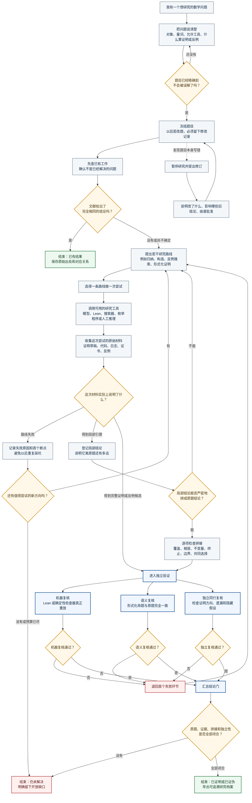

# RK：一个数理用户眼中的研究状态机

> 这是一张**用户旅程图**，不是数据库或程序内部状态图。它回答的是：研究者现在在想
> 什么、RK 应该做什么、什么时候可以相信结论。

## 一个真实用户会怎样使用

假设用户研究一个有限域组合猜想：

1. 用户先把原题和精确否定写进去，而不是直接问模型“帮我证明”。
2. RK 先查文献，再让用户选择几条互相独立的路线。
3. 一条路线交给大模型生成思路；另一条交给枚举程序找小反例；如果出现可形式化的
   引理，再交给 Lean。
4. 模型回复“证明完成”时，系统只把它记为**候选材料**，不会立刻把原题标成已证明。
5. 只有原题语义、机器重放、局部引理拼接和独立复核都闭合，才允许导出“已证明”。
6. 如果预算耗尽或某个拼接缺口始终无法关闭，系统应诚实结束为“仍未解决”，同时保留
   已证局部引理、失败路线和下一步建议。

## 当前实现会在哪里出问题

这张图描述的是 RK 应向用户呈现的自然研究过程。远端已真实跑通
`LeanSearch → OpenCode/DeepSeek → jixia → 独立 Lean replay`，并修掉了自报
`REPLAY_PASS`、陈旧输出、租约泄漏、预算只记账、OpenCode 完成后不退出，以及 jixia
在新 worktree 中把 `.olean` 写错位置等问题。机器晋级现在要求绑定 attempt、profile、
源码/输出/二进制摘要和一次性宿主签名回执。

仍然存在的产品边界：

- OS 网络关闭和 Mathlib cache 只读挂载仍是 `UNENFORCED`，所以只称本地干净重放，
  不称敌对隔离；
- 公共 LeanSearch 没有线上部署版本证明；
- 语义忠实性和真实人类同行复核仍需外部责任人完成；
- `AmendContract` 仍主动返回“暂不可用”；
- QED-Nano、DeepSeek-Prover 已下载、实测并由实时硬件计划选择进入 soft-only 候选工具；
  未配置本地资产时使用 API 候选路径，不伪装为本地模型。
  路由；专用模型输出不能直接改变数学状态。

因此，当前 RK 已是一个**能执行并审计小型 Lean 闭环的可信内部原型**，还不是完整、
敌对隔离、自动裁决所有数学任务的产品。
